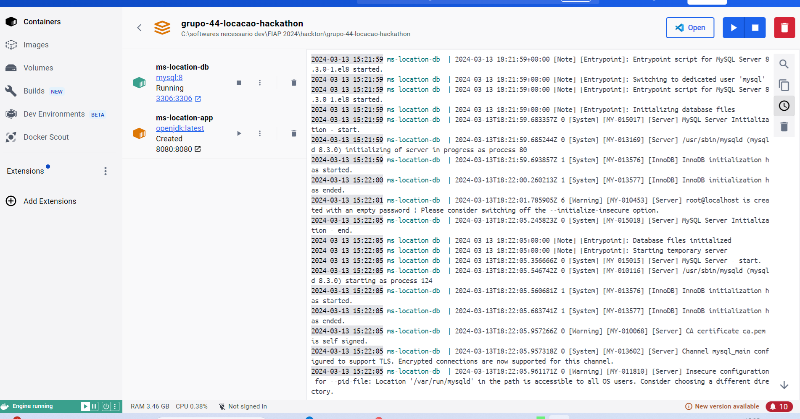

# GRUPO 44 Locação  Hackathon



## Introdução:

Conforme foi solocitado para atender a demanda de um sistema gerencial de reservas de quartos (locação) foram desenvolvidos 5 APIS para este projeto: Endereço, localidade, predio, quarto, serviços e itens, reserva e pessoa. 

<h1 align="center">
  Desenvolvimento das APIs
</h1>

## Tecnologias

[GitLab](https://about.gitlab.com/):Plataforma de gerenciamento de ciclo de vida de desenvolvimento de software com versionamento de codigo git.

[GitLab](https://about.gitlab.com/):Plataforma de gerenciamento de ciclo de vida de desenvolvimento de software com versionamento de codigo git.
- [Spring Boot](https://spring.io/projects/spring-boot):Modulo derivado do Spring Framework que facilita desenvolvimento de aplicações java implementando injeção e inversão de dependencias
- [Postman](https://learning.postman.com/docs/developer/postman-api/intro-api/): Ferramenta destinada a desenvolvedores que possibilita testar chamadas API e gerar documentação de forma iterativa.Foi usado neste projeto para gerar collections e realizar teste de chamadas aos endpoints;
- [Tortoise](https://tortoisegit.org/docs/tortoisegit/): Ferramenta gerencial que facilita manipulação de projetos em GIT. Foi usado neste projeto para resolução de conflitos.
- [Sourcetree](https://confluence.atlassian.com/get-started-with-sourcetree): Assim como o Tortoise é uma ferramenta gerencial para facilitar o desenvolvimento de projetos em Git, no entanto possui uma interface mais receptivel e navegabilidade facilitada.Foi usado neste projeto paa navegação e criação de ramos.
## Práticas adotadas


- Uso de DTOs para a API
- Injeção de Dependências
- Arquitetura hexagonal
- Testes unitarios e Mocks

## Escalabilidade de sistema:

- [Modularização em Containner e Docker](https://about.gitlab.com/): Docker é uma plataforma de código aberto que facilita a criação, implantação e gerenciamento de aplicativos por meio de contêineres, que são ambientes isolados e leves. Esses contêineres empacotam aplicativos e suas dependências, permitindo uma execução consistente em diversos sistemas, eliminando problemas de compatibilidade e melhorando a eficiência no desenvolvimento.

```
version: '3'

services:
  ms-location-app: # Renomeado para ms-location-app
    image: openjdk:latest
    container_name: ms-location-app # Renomeado
    working_dir: /app
    volumes:
      - ./target:/app
    ports:
      - "8080:8080"
    environment:
      - SPRING_DATASOURCE_URL=jdbc:mysql://ms-location-db:3306/ms_location?createDatabaseIfNotExist=true&useTimezone=true&serverTimezone=America/Sao_Paulo # Corrigido o nome do serviço
      - SPRING_DATASOURCE_USERNAME=root
      - SPRING_DATASOURCE_PASSWORD=
    depends_on:
      - ms-location-db # Renomeado
    command: ["java", "-jar", "/app/location-app.jar"]

  ms-location-db: # Renomeado para ms-location-db
    image: mysql:8
    container_name: ms-location-db # Renomeado
    environment:
      - MYSQL_ALLOW_EMPTY_PASSWORD=true
      - MYSQL_DATABASE=grupo44
    ports:
      - "3306:3306"


```
- [CI](https://about.gitlab.com/) (Continuous Integration):  CI (Continuous Integration) é uma prática de desenvolvimento em que as alterações de código são regularmente integradas e testadas automaticamente. O GitLab CI automatiza esse processo, organizando-o em pipelines, que representam as etapas de construção, teste e implantação de um aplicativo. Isso melhora a eficiência e a qualidade do desenvolvimento de software.[Veja pipeline executada](https://gitlab.com/mattec1/grupo-44-sistema-de-parquimetro-fiap/-/jobs/5473301001)

```
###############################################
##### Pipeline Gitlab-CI - v1.0           #####
##### MATTEC PROJETOS  - 13/03/2024       #####
##### GRUPO 44 LOCACAO HACKATHON FIAP     #####
###############################################


stages:
  - teste
  - build
  - deploy


executar_teste:
  stage: teste
  before_script:
    - echo "Preparando testes..."
    - chmod +x ./script.sh
  script:
    - ./script.sh
  after_script:
    - echo "Apagando arquivos temporários..."

executar_teste2:
  image: node:19.1
  needs:
    - executar_teste
  stage: teste
  script:
    - echo "Executando mais um teste..."
    - npm version

criar_imagens:
  stage: build
  script:
    - echo "Criando as imagens..."

push_imagens:
  needs:
    - criar_imagens
  stage: build
  script:
    echo "Realizando upload das imagens..."

kubernetes:
  stage: deploy
  script:
    - echo "Executando deploy..."


```


## Como Executar

### Localmente
- Clonar repositório git
- Construir o projeto:
```
./mvnw clean package
```
- Executar:


A API poderá ser acessada em [localhost:8080](http://localhost:8080)

O Swagger poderá ser visualizado em [localhost:8080/swagger-ui.html](http://localhost:8080/swagger-ui.html)


<h1 align="center">
  API ENDEREÇO
</h1>

<p align="center">
 https://gitlab.com/mattec1/grupo-44-locacao-hackathon
</p>

Esta api deve ser a primeira a ser executada visto que os gestores a utlizarão para alimentar a base de conhecimento e dependencias para demais apis.
## API Endpoints

CADASTRO DE ENDEREÇOS

```
Requet:

curl --location 'http://localhost:8080/api/v1/enderecos/cadastrar' \
--header 'Content-Type: application/json' \
--data '{
  "rua": "Rua das Flores",
  "numero": 123,
  "bairro": "Centro",
  "cidade": "São Paulo",
  "estado": "SP",
  "cep": "01234-567"
}'                           
```
* ATUALIZAÇÃo DE ENDEREÇOS:
```
Request:
curl --location --request PUT 'http://localhost:8080/api/v1/enderecos/atualizar/1' \
--header 'Content-Type: application/json' \
--data '{
  "id": 1,
  "rua": "Rua das Flores",
  "numero": 125,
  "bairro": "Centro",
  "cidade": "São Paulo",
  "estado": "SP",
  "cep": "01234-567"
}'
```

LISTAR ENDEREÇOS

- GET /alocacao

```
http GET http://localhost:8080/api/v1/enderecos/buscar-todos

Request:

curl --location 'http://localhost:8080/api/v1/enderecos/buscar-todos' \
--data ''

Response:
{
    "data": [
        {
            "id": 1,
            "rua": "Rua das Flores",
            "numero": 123,
            "bairro": "Centro",
            "cidade": "São Paulo",
            "estado": "SP",
            "cep": "01234-567"
        }
    ],
    "paginator": {
        "pageNumber": 0,
        "totalElements": 1,
        "totalPages": 1
    }
}


```

* DELEÇÃO DE ENDEREÇOS:
```
Request:
curl --location --request DELETE 'http://localhost:8080/api/v1/enderecos/apagar/1' \
--data ''
```


<h1 align="center">
  API LOCALIDADES
</h1>

<p align="center">
 https://gitlab.com/mattec1/grupo-44-locacao-hackathon
</p>

Após alimentar a base com os possiveis endereços, o gestor deve cadastrar mais informações sobre a localidade
## API Endpoints


Lista de formas de pagamento

- CADASTRO DE LOCALIDADE

```
curl --location 'http://localhost:8080/api/v1/localidades' \
--header 'Content-Type: application/json' \
--data '{
  "id": 1,
  "nome": "Localidade Teste",
  "enderecoDTO": {
    "id": 1
  },
  "idsAmenidades": [1, 2, 3]
}
'
```

* ATUALIZAÇÃO
```
curl --location --request PUT 'http://localhost:8080/api/v1/localidades/1' \
--header 'Content-Type: application/json' \
--data '{
  "id": 1,
  "nome": "Localidade Teste update",
  "enderecoDTO": {
    "id": 1
  },
  "idsAmenidades": [1, 2, 3]
}
'
```

LISTA TODAS LOCALIDADES

```
curl --location 'http://localhost:8080/api/v1/localidades' \
--data ''                    
```
BUSCA LOCALIDADE POR ID:

```
curl --location 'http://localhost:8080/api/v1/localidades/1' \
--data ''                    
```
DELEÇÃO DE LOCALIDADE
```
curl --location --request DELETE 'http://localhost:8080/api/v1/localidades/1' \
--data ''
```
DELEÇÃO DE FORMA DE PAGAMENTO
- DELETE /formaPagto/{id}
```
DELETE http://localhost:8080/formaPagto/9
HTTP/1.1 204 No Content
Content-Length: 142
Content-Type: application/json

```
<h1 align="center">
  API PREDIOS
</h1>

<p align="center">
 https://gitlab.com/mattec1/grupo-44-sistema-de-parquimetro-fiap 
</p>


## API Endpoints

Agora os gestores devem cadastrar os predios pertencentes a cada localidade

CADASTRO DE PREDIOS
```
curl --location 'http://localhost:8080/api/v1/predio' \
--header 'Content-Type: application/json' \
--data '{
  "id": 1,
  "nome": "Prédio Teste",
  "localidade": {
    "id": 1
  }
}
'

```
ATUALIZAÇÃO DE PREDIOS
- POST /condutores
```
http POST http://localhost:8080/pescondutores

HTTP/1.1 200 OK
Content-Length: 129
Content-Type: application/json

{
  "nome": "João",
  "sobrenome": "Silva",
  "dataNascimento": "1990-01-15",
  "sexo": "M",
  "idade": 32,
  "email":"herickraposo97@gmail.com",
  "phone": "123-456-7890",
  "cell": "987-654-3210",
  "fotosUrls": "https://acesse.one/3otj2",
  "nat": "Brasil"
}
```

- GET /pessoas/{id}
```
http://localhost:8080/condutores/6
HTTP/1.1 200 OK
Content-Length: 129
Content-Type: application/json

{
    "id": 6,
    "nome": "João",
    "sobrenome": "Silva",
    "dataNascimento": "1990-01-15",
    "sexo": "M",
    "idade": 32,
    "email": "herickraposo97@gmail.com",
    "phone": "123-456-7890",
    "cell": "987-654-3210",
    "fotosUrls": "https://acesse.one/3otj2",
    "nat": "Brasil",
    "veiculos": [
        {
            "id": 8,
            "marca": "HYUNDAI",
            "modelo": "HB20",
            "matricula": "PUN2515",
            "cavalos": 300
        }
    ]
}           
```

- PUT /pesscondutoresoas/3
```
tp://localhost:8080/condutores/3
HTTP/1.1 200 OK
Content-Type: application/json
transfer-encoding: chunked

{
    "id": 3,
    "nome": "João",
    "sobrenome": "Silva",
    "dataNascimento": "1990-01-15",
    "sexo": "M",
    "idade": 32,
    "email": "herickraposo97@gmail.com",
    "phone": "123-456-7890",
    "cell": "987-654-3210",
    "fotosUrls": "https://acesse.one/3otj2",
    "nat": "Brasil",
}
```
Alteração de campo único por exemplo:
- PATCH /condutores/{id}
```
PATCH http://localhost:8080/condutores/1
HTTP/1.1 200 OK
Content-Length: 142
Content-Type: application/json

{

   "sobrenome": "Rancho fundo Mauá"
           
}
 Retorna a alteração 
{
    "id": 1,
    "nome": "Fernanda",
    "sobrenome": "Rancho fundo Mauá",
    "dataNascimento": "1971-01-21",
    "sexo": "F"
}
```

Deletando uma pessoa:
- DELETE /condutores/{id}
```
DELETE http://localhost:8080/condutores/1
HTTP/1.1 204 No Content
Content-Length: 142
Content-Type: application/json

```

<h1 align="center">
  API VEICULO
</h1>

<p align="center">
 https://gitlab.com/mattec1/grupo-44-sistema-de-parquimetro-fiap 
</p>

API para gerenciamento de veiculos. Ao consumir esta api o desenvolvedor conseguirá realizar a criação, leitura,atualização,leitura e deleção(CRUD) dos registros de veiculos.

## API Endpoints


Lista de veiculos

- GET /veiculo

```
http GET http://localhost:8080/veiculo
{
    "content": [
        {
            "id": 7,
            "marca": "FIAT",
            "modelo": "UNO",
            "matricula": "1239123832924",
            "cavalos": 500,
            "condutor": {
                "id": 3,
                "nome": "João",
                "sobrenome": "Silva",
                "dataNascimento": "1990-01-15",
                "sexo": "M",
                "idade": 32,
                "email": "herickraposo97@gmail.com",
                "phone": "123-456-7890",
                "cell": "987-654-3210",
                "fotosUrls": "https://acesse.one/3otj2",
                "nat": "Brasil",
            },
            "listaAlocacao": [
                {
                    "id": 1,
                    "dataEntrada": "2023-11-02T08:00:00.000+00:00",
                    "dataSaida": null,
                    "dataInicioPago": "2023-11-02T08:00:00.000+00:00",
                    "dataFimPago": null
                },
                {
                    "id": 2,
                    "dataEntrada": "2023-11-02T08:00:00.000+00:00",
                    "dataSaida": "2023-11-02T17:07:26.000+00:00",
                    "dataInicioPago": "2023-11-02T08:00:00.000+00:00",
                    "dataFimPago": "2023-11-02T18:00:00.000+00:00"
                }
            ]
        },
        {
            "id": 8,
            "marca": "HYUNDAI",
            "modelo": "HB20",
            "matricula": "PUN2515",
            "cavalos": 300,
            "condutor": {
                "id": 6,
                "nome": "João",
                "sobrenome": "Silva",
                "dataNascimento": "1990-01-15",
                "sexo": "M",
                "idade": 32,
                "email": "herickraposo97@gmail.com",
                "phone": "123-456-7890",
                "cell": "987-654-3210",
                "fotosUrls": "https://acesse.one/3otj2",
                "nat": "Brasil",
            },
            "listaAlocacao": [
                {
                    "id": 8,
                    "dataEntrada": "2023-11-05T10:00:00.000+00:00",
                    "dataSaida": null,
                    "dataInicioPago": "2023-11-05T10:00:00.000+00:00",
                    "dataFimPago": "2023-11-05T10:00:00.000+00:00"
                },
                {
                    "id": 9,
                    "dataEntrada": "2023-11-05T10:00:00.000+00:00",
                    "dataSaida": "2023-11-05T12:38:05.000+00:00",
                    "dataInicioPago": "2023-11-05T10:00:00.000+00:00",
                    "dataFimPago": "2023-11-05T10:00:00.000+00:00"
                }
            ]
        }
    ],
    "pageable": {
        "pageNumber": 0,
        "pageSize": 10,
        "sort": {
            "empty": true,
            "sorted": false,
            "unsorted": true
        },
        "offset": 0,
        "paged": true,
        "unpaged": false
    },
    "last": true,
    "totalElements": 2,
    "totalPages": 1,
    "size": 10,
    "number": 0,
    "sort": {
        "empty": true,
        "sorted": false,
        "unsorted": true
    },
    "numberOfElements": 2,
    "first": true,
    "empty": false
}
```

Possiveis filtros;
- - **pagina**:Parametro não obrigatório que define o numero da pagina que o usuário deseja acessar
- - **tamanho**: Parametro não obrigatório que define a quantidade de itens que serão retornados pela listagem
- - **matriculaina**: Inscrição do veiculo
- - **marca**: Marca do veiculo
- - **Modelo**: Modelo do veiculo


* GET /veiculo/{id}
```
http://localhost:8080/veiculo/8

 {
    "id": 8,
    "marca": "HYUNDAI",
    "modelo": "HB20",
    "matricula": "PUN2515",
    "cavalos": 300,
    "condutor": {
        "id": 6,
        "nome": "João",
        "sobrenome": "Silva",
        "dataNascimento": "1990-01-15",
        "sexo": "M",
        "idade": 32,
        "email": "herickraposo97@gmail.com",
        "phone": "123-456-7890",
        "cell": "987-654-3210",
        "fotosUrls": "https://acesse.one/3otj2",
        "nat": "Brasil",
    },
    "listaAlocacao": [
        {
            "id": 8,
            "dataEntrada": "2023-11-05T10:00:00.000+00:00",
            "dataSaida": null,
            "dataInicioPago": "2023-11-05T10:00:00.000+00:00",
            "dataFimPago": "2023-11-05T10:00:00.000+00:00"
        },
        {
            "id": 9,
            "dataEntrada": "2023-11-05T10:00:00.000+00:00",
            "dataSaida": "2023-11-05T12:38:05.000+00:00",
            "dataInicioPago": "2023-11-05T10:00:00.000+00:00",
            "dataFimPago": "2023-11-05T10:00:00.000+00:00"
        }
    ]
}
```

CADASTRO DE VEICULO
* POST /veiculoVEICULO

```
http POST http://localhost:8080/veiculo
HTTP/1.1 201 CREATED
Content-Length: 129
Content-Type: application/json

{
  "marca": "HYUNDAI",
  "modelo": "HB20",
  "matricula": "PUN2515",
  "cavalos": 300,
  "condutor": {
    "id": 6
  }
}
```
ATUALIZAÇÃO DE VEICULO:

- PUT /veiculo/9
```
http://localhost:8080/veiculo/9
HTTP/1.1 200 OK
Content-Length: 129
Content-Type: application/json

{
  "id":9,
  "marca": "HYUNDAI",
  "modelo": "HB20",
  "matricula": "PUN2515",
  "cavalos": 300,
  "condutor": {
    "id": 6
  }
}
```
- PATCH: /veiculo/9
```
http://localhost:8080/veiculo/9
HTTP/1.1 200 OK
Content-Length: 129
Content-Type: application/json

{
  "modelo": "HB20"
}
```
DELEÇÃO DE VEICULO
- DELETE /eletrodomesticos/{id}
```
DELETE http://localhost:8080/veiculo/9
HTTP/1.1 204 No Content
Content-Length: 142
Content-Type: application/json

```
<h1 align="center">
  API PARAMETRIZAÇÃO DE PAGAMENTO
</h1>
<p align="center">
 https://gitlab.com/mattec1/grupo-44-sistema-de-parquimetro-fiap 
</p>

API para parametrização de siste. Ao consumir esta api o desenvolvedor conseguirá realizar a criação, leitura,atualização,leitura e deleção(CRUD) dos registros de veiculos.


## API Endpoints

#LISTA DE PARAMETRIZAÇÃO PAGAMENTO

```
GET http://localhost:8080/parametrizacaoPagto

RESPONSE
{
    "data": {
        "content": [
            {
                "id": 8,
                "data": "2023-11-02",
                "valorPorHora": 10.50,
                "formaPagamento": {
                    "id": 2,
                    "descricao": "CREDITO",
                    "estado": true
                },
                "periodoEstacionamento": "POR_HORA"
            },
            {
                "id": 9,
                "data": "2023-11-05",
                "valorPorHora": 10.50,
                "formaPagamento": {
                    "id": 2,
                    "descricao": "CREDITO",
                    "estado": true
                },
                "periodoEstacionamento": "FIXO"
            },
            {
                "id": 10,
                "data": "2023-11-02",
                "valorPorHora": 10.50,
                "formaPagamento": {
                    "id": 2,
                    "descricao": "CREDITO",
                    "estado": true
                },
                "periodoEstacionamento": "POR_HORA"
            }
        ],
        "pageable": {
            "pageNumber": 0,
            "pageSize": 10,
            "sort": {
                "empty": true,
                "sorted": false,
                "unsorted": true
            },
            "offset": 0,
            "paged": true,
            "unpaged": false
        },
        "last": true,
        "totalElements": 3,
        "totalPages": 1,
        "size": 10,
        "number": 0,
        "sort": {
            "empty": true,
            "sorted": false,
            "unsorted": true
        },
        "numberOfElements": 3,
        "first": true,
        "empty": false
    },
    "paginator": {
        "pageNumber": 0,
        "totalElements": 3,
        "totalPages": 1
    }
}

```
LISTAR POR ID


```
GET http://localhost:8080/parametrizacaoPagto/10

RESPONSE:
{
    "id": 10,
    "data": "2023-11-02",
    "valorPorHora": 10.50,
    "formaPagamento": {
        "id": 2,
        "descricao": "CREDITO",
        "estado": true
    },
    "periodoEstacionamento": "POR_HORA"
}


```
#CADASTRAR PARAMETRIZAÇÃO PAGAMENTO

```
POST http://localhost:8080/parametrizacaoPagto

HTTP/1.1 201 CREATED
Content-Length: 129
Content-Type: application/json

REQUEST BODY

{
  "data": "2023-11-02",
  "valorPorHora": 10.5,
  "formaPagamento": {
    "id": 2
  },
  "periodoEstacionamento": "POR_HORA"
}
```
#ATUALIZAR PARAMETRIZAÇÃO PAGAMENTO

```
PUT http://localhost:8080/parametrizacaoPagto/1

{
  "id": 1,
  "data": "2023-11-02",
  "valorPorHora": 14.5,
  "formaPagamento": {
    "id": 2
  },
  "periodoEstacionamento": "POR_HORA"
}
```
DELETANDO PARAMETRIZAÇÃO PAGAMENTO
```

http://localhost:8080/parametrizacaoPagto/10

HTTP/1.1 204 No Content
Content-Length: 142
Content-Type: application/json
```

<h1 align="center">
  API ALOCAÇÃO
</h1>

<p align="center">
 https://gitlab.com/mattec1/grupo-44-sistema-de-parquimetro-fiap 
</p>

A API de alocação consiste no enfoque central da aplicação, na alocação podemos encontrar  de forma centralizada informações de parametrização de pagamento, veiculo alem das informações convencionais como datas de entrada e saida bem como de pagamento.
De forma especial para que fosse calculado o tempo de estacionamento foi criada rtina e endpoint de verificação de tempo de alocação. Após controle é enviado email para condutores de tempo fixo alarmando quanto tempo falta para finalizar a alocação e para condutores que optaram para tempo variavel envia email informando sobre a renovação automatica da alocação.


envioEmail.PNG

## API Endpoints


Lista de ALOCAÇÃO

- GET /alocacao

```
http GET http://localhost:8080/alocacao
{
    "data": [
        {
            "id": 1,
            "dataEntrada": "2023-11-02T08:00:00.000+00:00",
            "dataSaida": null,
            "dataInicioPago": "2023-11-02T08:00:00.000+00:00",
            "dataFimPago": null,
            "veiculo": {
                "id": 7,
                "marca": "FIAT",
                "modelo": "UNO",
                "matricula": "1239123832924",
                "cavalos": 500
            },
            "estacionamento": {
                "id": 2,
                "descricao": "Vaga B",
                "estado": true
            },
            "parametrizacaoPagto": {
                "id": 8,
                "data": "2023-11-02",
                "valorPorHora": 10.50,
                "formaPagamento": null,
                "periodoEstacionamento": "POR_HORA"
            }
        },
        {
            "id": 2,
            "dataEntrada": "2023-11-02T08:00:00.000+00:00",
            "dataSaida": "2023-11-02T17:07:26.000+00:00",
            "dataInicioPago": "2023-11-02T08:00:00.000+00:00",
            "dataFimPago": "2023-11-02T18:00:00.000+00:00",
            "veiculo": {
                "id": 7,
                "marca": "FIAT",
                "modelo": "UNO",
                "matricula": "1239123832924",
                "cavalos": 500
            },
            "estacionamento": {
                "id": 2,
                "descricao": "Vaga B",
                "estado": true
            },
            "parametrizacaoPagto": {
                "id": 8,
                "data": "2023-11-02",
                "valorPorHora": 10.50,
                "formaPagamento": null,
                "periodoEstacionamento": "POR_HORA"
            }
        },
        {
            "id": 3,
            "dataEntrada": "2023-11-02T08:00:00.000+00:00",
            "dataSaida": "2023-11-05T12:31:13.000+00:00",
            "dataInicioPago": "2023-11-02T08:00:00.000+00:00",
            "dataFimPago": "2023-11-05T12:31:13.000+00:00",
            "veiculo": {
                "id": 7,
                "marca": "FIAT",
                "modelo": "UNO",
                "matricula": "1239123832924",
                "cavalos": 500
            },
            "estacionamento": {
                "id": 2,
                "descricao": "Vaga B",
                "estado": true
            },
            "parametrizacaoPagto": {
                "id": 8,
                "data": "2023-11-02",
                "valorPorHora": 10.50,
                "formaPagamento": null,
                "periodoEstacionamento": "POR_HORA"
            }
        },
        {
            "id": 4,
            "dataEntrada": "2023-11-02T08:00:00.000+00:00",
            "dataSaida": "2023-11-05T12:33:37.000+00:00",
            "dataInicioPago": "2023-11-02T08:00:00.000+00:00",
            "dataFimPago": "2023-11-05T12:33:37.000+00:00",
            "veiculo": {
                "id": 7,
                "marca": "FIAT",
                "modelo": "UNO",
                "matricula": "1239123832924",
                "cavalos": 500
            },
            "estacionamento": {
                "id": 2,
                "descricao": "Vaga B",
                "estado": true
            },
            "parametrizacaoPagto": {
                "id": 8,
                "data": "2023-11-02",
                "valorPorHora": 10.50,
                "formaPagamento": null,
                "periodoEstacionamento": "POR_HORA"
            }
        },
        {
            "id": 5,
            "dataEntrada": "2023-11-02T08:00:00.000+00:00",
            "dataSaida": "2023-11-05T12:34:32.000+00:00",
            "dataInicioPago": "2023-11-02T08:00:00.000+00:00",
            "dataFimPago": "2023-11-02T18:00:00.000+00:00",
            "veiculo": {
                "id": 7,
                "marca": "FIAT",
                "modelo": "UNO",
                "matricula": "1239123832924",
                "cavalos": 500
            },
            "estacionamento": {
                "id": 2,
                "descricao": "Vaga B",
                "estado": true
            },
            "parametrizacaoPagto": {
                "id": 8,
                "data": "2023-11-02",
                "valorPorHora": 10.50,
                "formaPagamento": null,
                "periodoEstacionamento": "POR_HORA"
            }
        },
        {
            "id": 6,
            "dataEntrada": "2023-11-02T08:00:00.000+00:00",
            "dataSaida": "2023-11-05T12:34:46.000+00:00",
            "dataInicioPago": "2023-11-02T08:00:00.000+00:00",
            "dataFimPago": "2023-11-05T12:31:13.000+00:00",
            "veiculo": {
                "id": 7,
                "marca": "FIAT",
                "modelo": "UNO",
                "matricula": "1239123832924",
                "cavalos": 500
            },
            "estacionamento": {
                "id": 2,
                "descricao": "Vaga B",
                "estado": true
            },
            "parametrizacaoPagto": {
                "id": 8,
                "data": "2023-11-02",
                "valorPorHora": 10.50,
                "formaPagamento": null,
                "periodoEstacionamento": "POR_HORA"
            }
        },
        {
            "id": 7,
            "dataEntrada": "2023-11-02T08:00:00.000+00:00",
            "dataSaida": "2023-11-05T12:34:51.000+00:00",
            "dataInicioPago": "2023-11-02T08:00:00.000+00:00",
            "dataFimPago": "2023-11-05T12:33:37.000+00:00",
            "veiculo": {
                "id": 7,
                "marca": "FIAT",
                "modelo": "UNO",
                "matricula": "1239123832924",
                "cavalos": 500
            },
            "estacionamento": {
                "id": 2,
                "descricao": "Vaga B",
                "estado": true
            },
            "parametrizacaoPagto": {
                "id": 8,
                "data": "2023-11-02",
                "valorPorHora": 10.50,
                "formaPagamento": null,
                "periodoEstacionamento": "POR_HORA"
            }
        },
        {
            "id": 8,
            "dataEntrada": "2023-11-05T10:00:00.000+00:00",
            "dataSaida": null,
            "dataInicioPago": "2023-11-05T10:00:00.000+00:00",
            "dataFimPago": "2023-11-05T10:00:00.000+00:00",
            "veiculo": {
                "id": 8,
                "marca": "HYUNDAI",
                "modelo": "HB20",
                "matricula": "PUN2515",
                "cavalos": 300
            },
            "estacionamento": {
                "id": 2,
                "descricao": "Vaga B",
                "estado": true
            },
            "parametrizacaoPagto": {
                "id": 9,
                "data": "2023-11-05",
                "valorPorHora": 10.50,
                "formaPagamento": null,
                "periodoEstacionamento": "FIXO"
            }
        },
        {
            "id": 9,
            "dataEntrada": "2023-11-05T10:00:00.000+00:00",
            "dataSaida": "2023-11-05T12:38:05.000+00:00",
            "dataInicioPago": "2023-11-05T10:00:00.000+00:00",
            "dataFimPago": "2023-11-05T10:00:00.000+00:00",
            "veiculo": {
                "id": 8,
                "marca": "HYUNDAI",
                "modelo": "HB20",
                "matricula": "PUN2515",
                "cavalos": 300
            },
            "estacionamento": {
                "id": 2,
                "descricao": "Vaga B",
                "estado": true
            },
            "parametrizacaoPagto": {
                "id": 9,
                "data": "2023-11-05",
                "valorPorHora": 10.50,
                "formaPagamento": null,
                "periodoEstacionamento": "FIXO"
            }
        }
    ],
    "paginator": {
        "pageNumber": 0,
        "totalElements": 9,
        "totalPages": 1
    }
}
```

Possiveis filtros;
- - **pagina**:Parametro não obrigatório que define o numero da pagina que o usuário deseja acessar
- - **tamanho**: Parametro não obrigatório que define a quantidade de itens que serão retornados pela listagem
- - **dataEntrada**: Data de inicio da alocação
- - **dataSaida**: Data baixa alocação
- - **dataInnicoPago**: Data inicio do pagamento
- - **dataFimPago**: Data termino do pagamento


* GET /alocacao/{id}
```
http://localhost:8080/alocacao/9

 {
    "id": 9,
    "dataEntrada": "2023-11-05T10:00:00.000+00:00",
    "dataSaida": "2023-11-05T12:38:05.000+00:00",
    "dataInicioPago": "2023-11-05T10:00:00.000+00:00",
    "dataFimPago": "2023-11-05T10:00:00.000+00:00",
    "veiculo": {
        "id": 8,
        "marca": "HYUNDAI",
        "modelo": "HB20",
        "matricula": "PUN2515",
        "cavalos": 300
    },
    "estacionamento": {
        "id": 2,
        "descricao": "Vaga B",
        "estado": true
    },
    "parametrizacaoPagto": {
        "id": 9,
        "data": "2023-11-05",
        "valorPorHora": 10.50,
        "formaPagamento": null,
        "periodoEstacionamento": "FIXO"
    }
}
```

CADASTRO DE ALOCAÇÃO
* POST /alocacao

```
http POST http://localhost:8080/alocacao
HTTP/1.1 201 CREATED
Content-Length: 129
Content-Type: application/json

{
  "dataEntrada": "2023-11-05T10:00:00",
  "dataInicioPago": "2023-11-05T10:00:00",
  "dataFimPago": "2023-11-05T10:00:00",
  "veiculo": {
    "id": 8
  },
  "estacionamento": {
    "id": 1
  },
  "parametrizacaoPagto": {
    "id": 9
    }
}                                       
```
ATUALIZAÇÃO DE ALOCAÇÃO:

- PUT /Alocação/9
```
http://localhost:8080/alocacao/9
HTTP/1.1 200 OK
Content-Length: 129
Content-Type: application/json

{
  "id":9,
  "dataEntrada": "2023-11-05T10:00:00",
  "dataInicioPago": "2023-11-05T10:00:00",
  "dataFimPago": "2023-11-05T10:00:00",
  "veiculo": {
    "id": 8
  },
  "estacionamento": {
    "id": 1
  },
  "parametrizacaoPagto": {
    "id": 9
    }
}                                       
```
- PATCH: /alocacao/9
```
http://localhost:8080/alocacao/9
HTTP/1.1 200 OK
Content-Length: 129
Content-Type: application/json

{
  "dataEntrada": "2023-11-05T10:00:00",
}
```
DELEÇÃO DE ALOCAÇÃO
- DELETE /alocacao/{id}
```
DELETE http://localhost:8080/alocacao/9
HTTP/1.1 204 No Content
Content-Length: 142
Content-Type: application/json


```